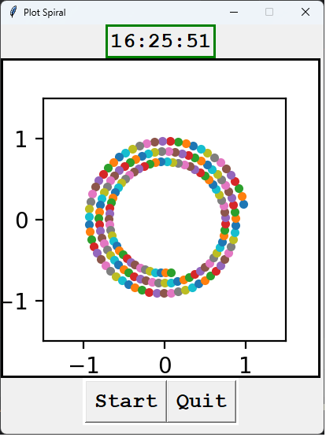

# Clock and Spiral Plot Application

## Description

This Python application is a simple GUI program developed with Tkinter and Matplotlib. It performs two primary functions simultaneously:

- **Real-Time Clock**: Displays the current time in hours, minutes, and seconds, updating continuously.
- **Dynamic Spiral Plot**: Continuously plots points in a spiral pattern that gradually shrinks, creating a visually appealing spiral animation.



## Features

- **Graphical User Interface (GUI)** built using Tkinter.
- **Real-time** display of the current system time.
- **Animated Spiral Plot** utilizing Matplotlib for visualization.
- **Start/Stop Controls**:
  - **Start**: Initializes and begins both the clock update and the spiral plotting.
  - **Quit**: Stops and closes the application.

## How to Run

### Prerequisites

- Python 3.x
- Tkinter (usually included with standard Python installations)
- Matplotlib
- NumPy

You can install required libraries using pip:

```bash
pip install matplotlib numpy
```

### Running the Application

Save the Python script (e.g., `clock_spiral.py`) and run it with:

```bash
python clock_spiral.py
```

## GUI Layout

The application window includes:

- **Top Frame**: Displays the continuously updating clock.
- **Center Frame**: Contains the animated spiral plot.
- **Bottom Frame**: Contains control buttons:
  - `Start` to initiate clock updates and spiral animation.
  - `Quit` to terminate and close the application.

## Author

Created as a Python GUI example demonstrating the integration of real-time updates and dynamic visualizations.